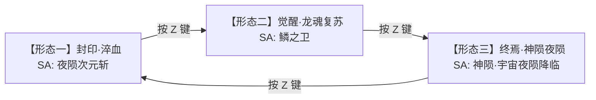

# 拔刀剑：终焉藏刀阁 (SlashBlade: Finale Blade Sanctum)


> **中文全称**：拔刀剑：终焉藏刀阁  
> **英文标识**：`SlashBlade: Finale Blade Sanctum`  
> **Mod ID**：`annihilationblade`  
> **作者**：青衣_璃  

---

## 📖 简介

**拔刀剑：终焉藏刀阁** 是一款基于 *SlashBlade / SlashBlade Resharped* 的 1.20.1 Forge 拔刀剑扩展模组。

本模组围绕 **“终焉、裂界、坍缩、审判、血狱、宇宙法则、混沌魔龙、萝莉法则”** 八大核心主题构建，提供了 **5 把机制独特的顶级命名刀**、完整严谨的 **SA / SE 战斗链路**、支持 Jupiter 配置系统的 **低风险参数调节**，以及兼具极佳视觉冲击力与流畅实战体验的 **动态渲染与控制体系**。

> [!NOTE]
> 当前 README 对应版本 **`2.9.2-1.20.1-forge`**。`2.8.0` 已作为正式版本发布。2.9.0 版本重构并拓展了萝莉刀体系、完善了合成表链路、统一规范了项目命名与描述体系。

---

## ✨ 核心特性

- 🗡️ **5 把机制与定位鲜明的顶级命名刀**：湮灭之刃·终焉、魔刀·血狱、最终兵器·无尽星空、魔龙夜陨、萝莉刀「萝莉(。>︿<   。)」。
- 🌀 **6 大专属 SA（Slash Art）**：`空间破碎`、`炼狱杀戮`、`绝对湮灭圈`、`夜陨次元斩`、`鳞之卫`、`萝莉终判`（以及神陨夜陨降临逻辑）。
- ⚡ **24 项注册 SE（Special Effect）**：涵盖终焉系 (8)、血狱系 (3)、宇宙法则系 (4)、魔龙系 (8) 与萝莉裁断系 (1)。
- 🎀 **萝莉刀服务端高压防护与契约机制**：主人唯一绑定、原生 SE/SA 主动处决、多维死锁防护、兜底重建（Theseus Guard）与可选高压对抗项。
- ⚙️ **Jupiter JSON 权威配置**：提供 `common.json`（服务端权威控制）与 `client.json`（客户端 Tooltip 视效开关），所有数值均附带安全边界防护。
- 🎨 **旗舰级专属 Tooltip 重绘系统**：无尽星空与湮灭之刃拥有专属 HUD/Tooltip 面板（流光黑洞、六芒星公转、谱线文字与权能芯片），支持一键开关回退原版样式。
- 🎮 **人性化按键控制与动作栏反馈**：支持断空闪现模式按键切换（默认 `Left Ctrl`）、魔龙夜陨三形态切换（默认 `Z`）、无尽星空 AI 删除切换（默认 `I`），且完美兼容 SlashBlade 原生友伤与 PVP 规则。

---

## 📋 环境与依赖

| 需求项目 | 推荐 / 要求版本 | 说明 |
| :--- | :--- | :--- |
| **Minecraft** | `1.20.1` | 基础游戏版本 |
| **Forge** | `47.4.21` | 模组加载器 |
| **Java** | `17` | 编译与运行环境（建议 OpenJDK / Zulu 17） |
| **基础前置** | **SlashBlade / SlashBlade Resharped** | 拔刀剑核心模组 |
| **必需前置** | **Jupiter `2.3.3-bugfix`** | 构件 ID: `2YdOW2Dk` (Modrinth)，用于 GUI 配置驱动与数据同步 |
| **可选联动** | **JEI (Just Enough Items) + JEI SlashBlade** | 提供命名刀、SA、SE 的图鉴与说明展示 |

---

## ⚔️ 命名刀体系

### 1. 湮灭之刃 · 终焉 (`annihilationblade:annihilation_blade`)

*撕裂虚空，终焉裁决。项目核心的主旗舰拔刀。*

- **定义路径**：`src/main/resources/data/annihilationblade/slashblade/named_blades/annihilation_blade.json`

| 属性 | 参数 |
| :--- | :--- |
| **基础攻击力** | `50.0` |
| **耐久度** | `2000` |
| **绑定 SA** | `annihilationblade:spatial_fracture` (空间破碎) |
| **挂载 SE 数量** | `8` 个终焉系 SE |
| **核心被动** | 绝对庇护、虚空飞行、终焉处决、永昼视界 |

> [!TIP]
> **战斗机制**：  
> - 位于背包、主手或副手时授予持刀者客户端全亮（永昼视界）效果。  
> - 伤害生效 5 tick 后，以受击位置为中心拉开裂界并处决周围合法目标。连锁次数与最大范围可在配置文件 `annihilation_blade.world_rift` 中调整。

---

### 2. 魔刀 · 血狱 (`annihilationblade:blood_prison`)

*以血养刃，危机与狂暴交织的嗜血之刀。*

- **定义路径**：`src/main/resources/data/annihilationblade/slashblade/named_blades/blood_prison.json`

| 属性 | 参数 |
| :--- | :--- |
| **基础攻击力** | `16.0` |
| **耐久度** | `2400` |
| **绑定 SA** | `annihilationblade:infernal_slaughter` (炼狱杀戮) |
| **挂载 SE** | `blood_leech` (嗜血)、`spirit_shield` (源流灵盾)、`phantom_mark` (幻影印记) |

> [!NOTE]
> **战斗机制**：围绕低生命风险、吸血、护盾生成与幻影爆发构建。核心数值固定于源码逻辑中，保障平衡性与服务端安全。

---

### 3. 最终兵器 · 无尽星空 (`annihilationblade:infinity_stellaris`)

*超越常规概念、掌控宇宙法则的终局兵器。*

- **定义路径**：`src/main/resources/data/annihilationblade/slashblade/named_blades/infinity_stellaris.json`

| 属性 | 参数 |
| :--- | :--- |
| **基础攻击力** | `1,000,000.0` (百万级) |
| **耐久度** | `2,147,483,647` (无限近极限) |
| **绑定 SA** | `annihilationblade:vacuum_decay_collapse` (绝对湮灭圈) |
| **挂载 SE** | `entropy_dissolution`、`curvature_rupture`、`gamma_thunderburst`、`cosmic_string_cut` |
| **核心被动** | 无敌、飞行、死亡拦截、kill 防御、虚空坠落保护、永昼视界 |

> [!IMPORTANT]
> **终局仪式合成**：需要 4 枚湮灭核心、1 枚龙蛋、2 座信标、1 枚下界之星，以及一把达到 `5000` 杀敌、`25000` 耀魂、`50` 精炼的魔刀·血狱。  
> **专属视效与快捷键**：  
> - 拥有专属高阶 Tooltip 重绘界面（可由配置自由切换）。  
> - 按 `I` 键可开关 **曲率撕裂 (Curvature Rupture)** 的合法目标 AI 封冻。

---

### 4. 魔龙夜陨 (`annihilationblade:nightfall_dragon`)

*融合混沌魔龙之力，随战斗节奏切换姿态的多元拔刀。*

- **定义路径**：`src/main/resources/data/annihilationblade/slashblade/named_blades/nightfall_dragon.json`

| 属性 | 参数 |
| :--- | :--- |
| **基础攻击力** | `22.0` |
| **耐久度** | `2400` |
| **形态按键** | `Z` 键（主/副手持有状态下循环切换） |

#### 三大形态明细表：



- **【形态一：封印·淬血】**：挂载 `demonic_blood_parasite` 与 `outer_god_scar`。命中可叠加魔血印记，造成最大生命百分比伤害与真实伤害；SA【夜陨次元斩】以玩家为中心生成 20 连发次元斩。
- **【形态二：觉醒·龙魂复苏】**：继承形态一，追加 `dragon_pressure_domain` 与 `reverse_scale_hunt`。获得速度 III、力量 III、夜视 III 与伤害吸收 III；SA【鳞之卫】召出 16 柄魔龙幻影剑环绕旋转后外展重砸。
- **【形态三：终焉·神陨夜陨】**：继承龙威与魔血，挂载 `dragon_god_body`、`absolute_annihilation_domain`、`myriad_dragon_blade_storm` 与 `world_cleaving_slash`。常驻创世神体兜底与最高 200 点创世龙盾，挥刀可释放 20 柄灭世龙刃与 72 格撕裂苍穹剑气；SA【神陨·宇宙夜陨降临】可锁定 40 格焦点，展开黑洞引力场并轰炸 15 轮夜陨星雨，随后坍缩清场。

---

### 5. 萝莉刀 「萝莉(。>︿<   。)」 (`annihilationblade:loli_blade`)

*高维法则附庸，自带可爱外表与绝对防御/处决契约的特别拔刀。*

- **定义路径**：`src/main/resources/data/annihilationblade/slashblade/named_blades/loli_blade.json`

| 属性 | 参数 |
| :--- | :--- |
| **基础攻击力** | `4.0` |
| **耐久度** | `1000` |
| **绑定 SA** | `annihilationblade:loli_area_execution` (萝莉终判) |
| **挂载 SE** | `loli_facing_execution` (萝莉裁断) |
| **原生附魔** | 耐久 X、抢夺 X、多重射击 X、力量 X、灵魂疾行 X、摔落缓冲 X、保护 X、击退 X、经验修补 X |

> [!WARNING]
> **契约与安全防御体系**：  
> 1. **主人绑定**：首次进入玩家物品栏时绑定 UUID，非主人持有完全失效。  
> 2. **主动处决**：挥刀自动触发 48 格扇形 SE 处决，SA 触发 128 格广域 SE 处决（伴随 `loli_success` 音效）。  
> 3. **多重守卫 (Theseus Guard & Mixin)**：拦截所有伤害、死亡、硬移除与虚空坠落；即使被非法代码强行移除实体，也会在 3 tick 内以相同身份重建。  
> 4. **高压对抗配置**：支持物理抹除 (`ultimate_obliterate`)、字节码不可杀 (`ultimate_invincible`) 与身份守卫 (`ultimate_theseus`)。

---

## 🔮 SA (Slash Art) 技能一览

| SA 名称 | 注册 ID | 对应武器 | 技能效果简述 |
| :--- | :--- | :--- | :--- |
| **空间破碎** | `annihilationblade:spatial_fracture` | 湮灭之刃 | 沿视线锁定落点展开裂隙蛛网与空间裂环，召唤密集剑雨并对目标逐个执行终焉处决。 |
| **炼狱杀戮** | `annihilationblade:infernal_slaughter` | 魔刀·血狱 | 展开血狱红莲领域，玩家在领域内快速穿梭斩击敌群，结束时根据伤害转化为自身治疗。 |
| **绝对湮灭圈** | `annihilationblade:vacuum_decay_collapse` | 无尽星空 | 展开 `128×128` 级水平正方真空衰变领域，持续 100 tick，入圈敌对单位直接热寂抹除并压制掉落。 |
| **夜陨次元斩** | `annihilationblade:nightfall_judgement_cut` | 魔龙夜陨 (形态一) | 扫描 20 格内目标，以节流序列每 5 tick 在敌人脚下浮现 1 个次元斩，共计 20 连斩。 |
| **鳞之卫** | `annihilationblade:scale_guard` | 魔龙夜陨 (形态二) | 召唤 16 柄魔龙幻影剑平铺环绕，加速旋转后向外扩张 5 格，升空后猛烈重砸并附带视角震屏。 |
| **神陨·宇宙夜陨降临** | `annihilationblade:cosmic_nightfall_descent` | 魔龙夜陨 (形态三) | 锁定 40 格焦点产生黑洞漩涡，密集轰炸 15 轮夜陨星雨，最后内核坍缩释放全屏冲击波。 |
| **萝莉终判** | `annihilationblade:loli_area_execution` | 萝莉刀 | 播放提示音效，以持刀者为中心展开 128 格无死角服务端全清处决。 |

---

## 🌀 SE (Special Effect) 特效注册表

模组包含 **24 个系统化 SE 注册项**：

| 分类 | SE 标识 | 中文名称 | 运行机制与表现 |
| :--- | :--- | :--- | :--- |
| **终焉系** | `dankong` | 断空 | 目标间连续闪现斩杀，支持按住 `Shift` 中断或返回起点 |
| | `world_rift` | 裂界 | 命中后在受击点生成拉扯裂隙，触发范围二次处决 |
| | `terminus_echo` | 归墟回响 | 朝面朝方向释放多波交替推进的虚空回响斩击 |
| | `void_dominion` | 虚无权域 | 展开前方广域投影，分批次执行高阶清场 |
| | `causality_collapse` | 因果坍缩 | 寻找最近目标建立因果锚点与连接斩线，触发连锁爆破 |
| | `starless_judgement` | 星寂裁决 | 在视线方向铺设星寂斩击带，按线段投影判定命中处决 |
| | `phantom_judgement` | 幻影审判 | 生成悬空幻影剑阵环绕锁定，随后集中倾泻击打 |
| | `abyssal_decree` | 归墟天诏 | 在头顶生成王权冠冕，自上而下降下垂直毁灭光束 |
| **血狱系** | `blood_leech` | 嗜血 | 造成伤害时按比例吸血，血量越低转化效率越高 |
| | `spirit_shield` | 源流灵盾 | 生命值低于阈值时强制生成抵伤护盾并赋予抗性 |
| | `phantom_mark` | 幻影印记 | 攻击命中积攒印记，满层后召唤幻影剑雨爆发 |
| **宇宙系** | `entropy_dissolution` | 熵增蚀解 | 命中叠加熵增，满 10 层直接触发热寂归零抹除 |
| | `curvature_rupture` | 曲率撕裂 | 按 `I` 键切换，手持时将 25 格内敌对 Mob 的 AI 完全封冻 |
| | `gamma_thunderburst` | 伽马霆暴 | 攻击触发玩家周围 128 格内连续 3 tick 降下彩色伽马闪电 |
| | `cosmic_string_cut` | 宇宙弦切 | 挥刀原生触发局部 5x5x5 星线，切断 128 格内敌对实体 |
| **魔龙系** | `demonic_blood_parasite` | 魔血寄生 | 叠加魔血印记，施加凋零 V、失明与最大生命魔法/真伤 |
| | `outer_god_scar` | 外神伤痕 | 挥刀召唤暗紫虚空裂隙与追猎幻影剑 |
| | `dragon_pressure_domain` | 龙威重域 | 常驻赋予持刀者速度 III、力量 III、夜视 III 与吸收 |
| | `reverse_scale_hunt` | 逆鳞剑阵 | 挥刀向前扇形扫出金紫逆鳞剑阵，赋予短暂抗性 |
| | `dragon_god_body` | 终焉神像 | 提供死锁兜底、飞行、免疫负面、伤害反弹与最高 200 龙盾 |
| | `absolute_annihilation_domain`| 终焉结界 | 每秒扫描 64 格内 128 个目标，剥离护盾与冻结 AI 并处决半血目标 |
| | `myriad_dragon_blade_storm` | 万刃龙魂 | 普通挥刀追加 20 柄暗金/星空紫灭世龙刃自动追猎 |
| | `world_cleaving_slash` | 灭界龙威 | 挥刀施放 72 格撕裂型虚空剑气并附带同源伽马闪电 |
| **萝莉系** | `loli_verdict` | 萝莉裁断 | 接管挥刀事件，沿视线执行 48 格扇形高压处决 |

---

## 🎮 控制与快捷键说明

模组内置了完善的玩家交互控制逻辑：

| 热键 / 操作 | 作用武器 | 功能与反馈 |
| :--- | :--- | :--- |
| **按住 `Shift`** | 湮灭之刃 | 防误触机制：按住时放弃开启新的 `断空` 闪现序列；若闪现进行中按住则立刻中断并安全返回起点。 |
| **`Left Ctrl`** (默认) | 湮灭之刃 | **断空模式切换**：在开启/关闭闪现之间切换，屏幕下方动作栏会显示本地化提示（如 `当前闪现：开/关`）。 |
| **`Z`** (默认) | 魔龙夜陨 | **形态循环切换**：在【封印·淬血】➔【觉醒·龙魂复苏】➔【终焉·神陨夜陨】三态间平滑切换。 |
| **`I`** (默认) | 无尽星空 | **曲率 AI 冻结开关**：自由切换是否启用 `曲率撕裂` 对周遭敌对目标的 AI 锁死。 |

---

## ⚙️ 配置文件体系 (Jupiter Integration)

首次运行游戏后，模组会在 `config/annihilationblade/` 生成两个结构化 JSON 配置文件：

1. **`common.json`** (*服务端权威*)
   - 包含绝大部分低风险逻辑参数：搜索范围、领域半径、粒子刷新步长、冷却 tick、最大连锁数、召唤剑数量、高压对抗选项等。
   - 所有配置均设置了合理的硬范围限制（Min/Max），防止数值溢出引发服务端崩端。
2. **`client.json`** (*客户端专用*)
   - 包含 `client_tooltips.enable_annihilation_blade_renderer` 与 `client_tooltips.enable_infinity_stellaris_renderer`。
   - 可一键关闭旗舰级专属 Tooltip 重绘，安全降级至原版 Tooltip 渲染，极佳地兼容第三方背包 HUD 模组。

---

## 🎨 拔刀剑 OBJ 模型制作指南

本章节根据 MC 百科教程《适用于“拔刀剑：重锋”的拔刀剑 obj 模型制作教程》整理，供团队维护或附属开发参考。

### 标准分组命名规范 (Groups)

制作或导出适用于 SlashBlade Resharped 的 OBJ 模型时，必须严格遵循以下分组名称：

| 分组名称 (Group Name) | 用途与生效视角 |
| :--- | :--- |
| **`sheath`** | 第三人称佩戴在腰间/背部的刀鞘 |
| **`blade`** | 第三人称持在手上的完整刀身 |
| **`blade_damaged`** | 耐久耗尽/断刀状态下的第 3 人称刀身 |
| **`blade_fragment`** | 拔刀断裂时飞出并掉落在地上的断刃碎片 |
| **`effect`** | 释放 SA 蓄力或按住时，刀鞘/刀身的发光特效层 |
| **`item_blade`** | 玩家物品栏、GUI 与 Item Zoom 视角下的完整刀 |
| **`item_damaged`** | 物品栏中的断刀图标 |
| **`blade_luminous` / `sheath_luminous`** | *[本项目扩展]* 满光能量流动渲染分组 |

> [!TIP]
> **Blender 关键要点**：
> - 导入基准拔刀剑模型后，**千万不要移动、旋转或缩放基准模型**，新模型必须以基准模型为“尺子”进行对齐。
> - 导出时请勾选 `Write Groups` (写入组)，并确保所有面均为三角面 (Triangulate Faces)。

---

## 🛠️ 构建与编译指南

请使用 **JDK 17** 环境进行项目构建：

```powershell
# Windows PowerShell 编译构建命令示例
$env:JAVA_HOME='C:\Program Files\Zulu\zulu-17'
$env:Path="$env:JAVA_HOME\bin;$env:Path"
$env:JAVA_TOOL_OPTIONS='-Dfile.encoding=UTF-8'

# 编译并生成 Jar 包
./gradlew.bat --no-daemon clean build --console=plain
```

构建完成后的产物将生成在：
`build/libs/slashblade-finale-blade-sanctum-2.9.2-1.20.1-forge.jar`

---

## 📝 更新日志 (Changelog)

> 分类说明：**新增 (Added)** \| **重构·变更 (Changed)** \| **修复 (Fixed)** \| **资源与视觉 (Assets & Visuals)** \| **文档 (Documentation)** \| **开发环境 (Development)**

### 2.9.2-1.20.1-forge

**新增 (Added)**
- **魔龙夜陨 Tooltip 视觉强化**：新增龙魂核心、动态轨道符文、鼠标斩痕反馈与形态状态舷窗，让三形态 Tooltip 拥有更强的层次感与实时动效。
- **新命名刀**：新增「萝莉(。>︿<   。)」(`annihilationblade:loli_blade`)，集成主人唯一绑定、防御兜底与十级原生附魔（耐久、抢夺、多重射击、力量、灵魂疾行、摔落缓冲、保护、击退、经验修补）。
- **萝莉刀本土化 SA/SE**：实装 `loli_facing_execution` SE (48格扇形处决) 与 `loli_area_execution` SA (128格广域处决，播放 `loli_success` 音效)。
- **究极高压与多维防护增补**：
  - `ultimate_obliterate` (物理抹除)：setter + `die()` + 负值压制 + 私有字段反射多重归零，绕过第三方面死。
  - `ultimate_invincible` (字节码不可杀)：通过 `LoliBladeLivingEntityMixin` 拦截字节码级伤害与死亡事件。
  - `ultimate_theseus` (Theseus Guard)：服务端每 tick 巡检，若实体被非法硬移除，将在 3 tick 内以相同 UUID 重建存在。
- **合成表补齐**：为 `annihilation_blade`、`nightfall_dragon` 与 `loli_blade` 补充 `slashblade:shaped_blade` 配方。

**重构/变更 (Changed)**
- **项目全量更名**：项目正式重命名为 `SlashBlade: Finale Blade Sanctum`（中文名：`拔刀剑：终焉藏刀阁`），同步更新 Gradle 构件名、模组描述与 README 架构。
- **萝莉刀架构优化**：移除旧版 `LeftClickEmpty` / `RightClickItem` 监听与网络包，全面接入 SlashBlade 原生 SA/SE 事件响应链。
- **萝莉刀攻击音效触发机制重构**：将原先仅在 SA 空放时广播的音效，重构为“当玩家主手手持萝莉之刃时，其释放的任何攻击（普通近战斩击、拔刀剑刀光与幻影剑、SE 扇形处决与 SA 全域处决）对合法生物造成任何伤害时播放 `loli_success` 音效”，并加入同一 Tick 多目标防爆音节流防护。

**修复 (Fixed)**
- **萝莉刀 SA 触发链路修复**：修复 `ModComboStates` 中 `LOLI_AREA_EXECUTION_STATE` 缺少 `TimeLineTickAction` 导致 SA 无法在服务端正常执行处决的问题，将其对齐名刀规范并在动作第 8 tick 执行广域处决。

**资源与视觉 (Assets & Visuals)**
- 补全 `loli_blade.obj` 与 `loli_blade.png`，支持连续鞘壳、立体挂坠、粉青发光晶体与彩虹能量刃纹。
- 注册 `annihilationblade:loli_success` 提示音效与资源路径映射。

---

### 2.8.0

**新增 (Added)**
- **魔龙夜陨完整形态链**：
  - 实装形态二 SA【鳞之卫】(`scale_guard`)：16 柄魔龙幻影剑环绕扩张重砸，带 `nightfall_screen_shake` 视角震屏。
  - 实装形态一 SA【夜陨次元斩】与形态三 SA【神陨·宇宙夜陨降临】。
  - 实现 `Z` 键三形态平滑切换。
- **Jupiter 配置全面接入**：迁移旧版 TOML 配置至 Jupiter `common.json` 与 `client.json` 体系。

**修复 (Fixed)**
- 修复魔龙夜陨召剑与反弹伤害引发的递归连锁叠加问题。
- 修复【鳞之卫】幻影剑模型错位与朝向异常，规范使用重锋原生 `EntityAbstractSummonedSword`。

---

### 2.7.0 – 2.7.2

**新增 (Added)**
- 引入顶级兵器「无尽星空」 (`infinity_stellaris`)，包含百万面板、最高级被动防守、旗舰级专属 Tooltip 界面与 `I` 键 AI 封冻。
- 增加无尽星空终局合成配方与各语言 JEI 联动图鉴支持。

---

## 💖 赞助与支持


> **制作不易，如果觉得模组好玩，欢迎支持作者买杯咖啡！**  
> ⚠️ **温馨提示**：若自身经济拮据请**绝对不要**赞助，照顾好自己的生活最重要！祝君安好！

